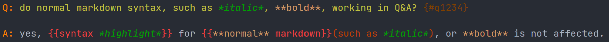

# Markdown Cornell Syntax Highlighting

settings.json

```json
    "editor.tokenColorCustomizations": {
        "textMateRules": [
            {
                "scope": "cornell.question",
                "settings": {
                    "foreground": "#ff6600",
                }
            },
            {
                "scope": "cornell.answer",
                "settings": {
                    "foreground": "#ff6600",
                }
            },
            {
                "scope": "supermemo.cloze",
                "settings": {
                    "foreground": "#FF8000",
                }
            },
            {
                "scope": "supermemo.cloze.hints",
                "settings": {
                    "foreground": "#C04040",
                }
            }
        ]
    },
```

## Building

```bash
vsce package
```

## Example

Q: do normal markdown syntax, such as *italic*, **bold**, working in Q&A?

A: yes, {{syntax *highlight*}} for {{**normal** markdown}}(such as *italic*), or **bold** is not affected.


